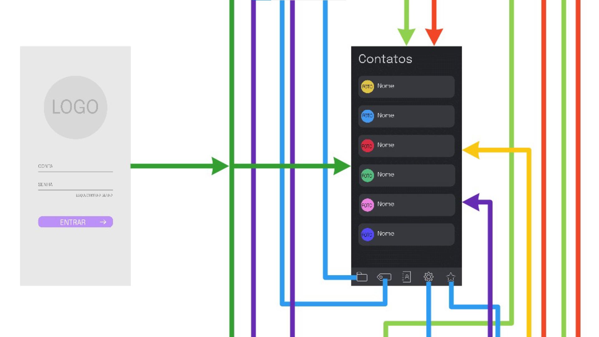
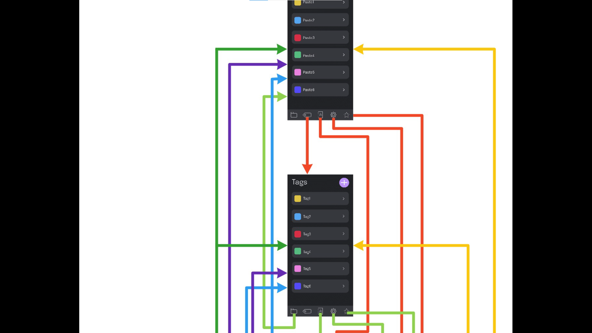
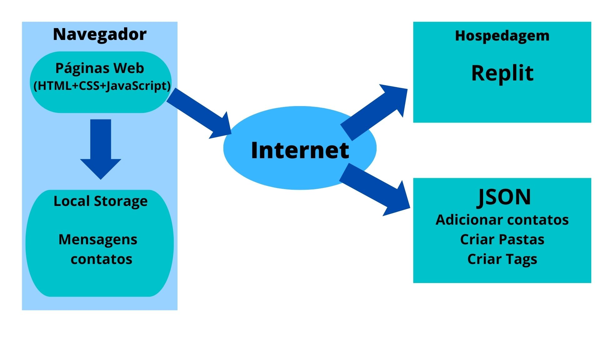

# Informações do Projeto
`Itext` 

`Trabalho Interdisciplinar: Aplicações WEB;Ciência da Computação` 

## Participantes
> Os membros do grupo são: 
> - Barbara Hellen Pereira Soraggi
> - Bernardo D'Ávila Rodrigues Bartholomeu
> - Camila Hollerbach Pimenta Macedo
> - Henrique Lourenço Pinto Coelho

# Estrutura do Documento

- [Informações do Projeto](#informações-do-projeto)
  - [Participantes](#participantes)
- [Estrutura do Documento](#estrutura-do-documento)
- [Introdução](#introdução)
  - [Problema](#problema)
  - [Objetivos](#objetivos)
  - [Justificativa](#justificativa)
  - [Público-Alvo](#público-alvo)
- [Especificações do Projeto](#especificações-do-projeto)
  - [Personas e Mapas de Empatia](#personas-e-mapas-de-empatia)
  - [Histórias de Usuários](#histórias-de-usuários)
  - [Requisitos](#requisitos)
    - [Requisitos Funcionais](#requisitos-funcionais)
    - [Requisitos não Funcionais](#requisitos-não-funcionais)
  - [Restrições](#restrições)
- [Projeto de Interface](#projeto-de-interface)
  - [User Flow](#user-flow)
  - [Wireframes](#wireframes)
- [Metodologia](#metodologia)
  - [Divisão de Papéis](#divisão-de-papéis)
  - [Ferramentas](#ferramentas)
  - [Controle de Versão](#controle-de-versão)
- [Projeto da Solução](#projeto-da-solução)
  - [Tecnologias Utilizadas](#tecnologias-utilizadas)
  - [Arquitetura da solução](#arquitetura-da-solução)
- [Avaliação da Aplicação](#avaliação-da-aplicação)
  - [Plano de Testes](#plano-de-testes)
  - [Ferramentas de Testes (Opcional)](#ferramentas-de-testes-opcional)
  - [Registros de Testes](#registros-de-testes)
- [Referências](#referências)

# Introdução

## Problema

Em grandes grupos e salas de conversa, devido ao elevado número de mensagens, sendo muitas delas não relevantes para o tópico principal do chat, é possível sentir uma frustração com a **falta de organização das mensagens importantes**, e por isso, gostaríamos de propor uma solução.

## Objetivos

Temos como objetivo geral propor um software para que usuários possam **organizar suas mensagens de forma fácil, customizável e objetiva.** 

>Como **objetivos específicos**, colocamos em evidência:
> - Garantir uma experiência fácil e intuitiva para o usuário
> - Oferecer variadas opções para a filtração de mensagens
> - Garantir uma interface bonita, minimalista e leve
> - Garantir a segurança de nossos usuários e criptografar suas mensagens

## Justificativa

  Após a realizarmos um quiz, com base nas respostas dadas as pessoas, percebemos suas frustrações de não poderem agrupar suas mensagens por ordem de prioridade e de não poderem separar suas mensagens mais importantes, para que sejam de fácil localização e acesso.

  Por isso, estamos realizando esse projeto com o intuito de ajudar os usuários a filtrarem as mensagens que eles julgam mais importantes, uma vez que, quando se tem muitos grupos diferentes e muitas pessoas em um só grupo, as mensagens acabam se perdendo e fica difícil achar aquela mensagem que você procura.

## Público-Alvo

Todos os indivíduos podem se beneficiar com esse projeto, mas nosso público alvo é qualquer pessoa que esteja inserida em um grande número de grupos ou que esteja em grupos que possuem muitos integrantes.

Mais especificamente, o foco desse projeto é para as pessoas que estão trabalhando/estagiando, estão na graduação ou que são CEO 's de grandes empresas que buscam filtrar e separar as mensagens importantes, das mensagens inúteis do dia a dia, uma vez que recebem um grande número de mensagens, já que possuem diversos grupos diferentes.

# Especificações do Projeto

A definição do problema e os pontos mais relevantes a serem tratados neste projeto foi consolidada a partir da participação dos usuários em formulário feito pelos membros da equipe. Os detalhes levantados nesse processo foram consolidados na forma de personas e histórias de usuários.

## Personas e Mapas de Empatia

> **Persona Ângela**
>    
> 
> 
> 
> 
> **Persona Bruna**
>    
> 
> 
> 
> 
> **Persona Pedro**
> 
> 
> 
> 
>

## Histórias de Usuários

Com base na análise das personas forma identificadas as seguintes histórias de usuários:

|EU COMO... `PERSONA`| QUERO/PRECISO ... `FUNCIONALIDADE` |PARA ... `MOTIVO/VALOR`                 |
|--------------------|------------------------------------|----------------------------------------|
| Ângela Mercury     | filtrar as informações importantes relacionadas ao meu curso.     | para caso alguém fale alguma coisa importante ou relevante relacionada a matéria, uma vez que, às vezes essas mensagens se perdem no meio de mensagens inúteis do dia a dia, como por exemplo futebol.              |
|Bruna Sampaio       | organizar e separar minhas mensagens pessoais e profissionais.      | para que assim consiga garantir notas melhores na faculdade, e consiga persuadir o seu sonho de, um dia, se tornar editora. |
|Pedro Alves         |organizar as mensagens dos meus vários grupos: de sair com amigos, de técnicas para bonsais, que é o meu hobby preferido, de minhas atividades esportivas e do meu trabalho.|para que eu consiga estar inteirado de todos os grupos de uma vez, sem me perder em todos eles.|

## Requisitos
Nosso projeto é definido por **requisitos funcionais**, que descrevem os principais aspectos do programa, assim como os **requisitos não funcionais**, que descrevem como o programa deve funcionar de uma forma mais geral. Estes requisitos estão apresentados abaixo.

### Requisitos Funcionais

|ID    | Descrição do Requisito  | Prioridade |
|------|-----------------------------------------|----|
|RF-001|dar ao usuário a opção de atribuir prioridade aos contatos.| ALTA | 
|RF-002|ter um sistema de tags que pode ser organizado por cores ou nomes. | ALTA |
|RF-003|apresentar a opção de destacar uma ou mais mensagens para todos os integrantes de um grupo.| ALTA |
|RF-004|ter um sistema de organização de mensagens por meio de pastas.| ALTA |
|RF-005|dar a opção de silenciar integrantes de um grupo individualmente.| MÉDIA |
|RF-006|ter um sistema de filtração de mensagens de áudio e mídias (fotos, vídeos e documentos).| MÉDIA |
|RF-007|apresentar a opção de implementar um sistema de cooldown para integrantes de um grupo.| MÉDIA |
|RF-008|dar a opção de implementar senhas para diferentes pastas e mensagens salvas.| BAIXA |
|RF-009|ter um modo noturno e um modo diurno.| BAIXA |
|RF-010|apresentar a opção individual de apagar as mensagens de um grupo após um certo tempo. | BAIXA |

### Requisitos não Funcionais

|ID     | Descrição do Requisito  |Prioridade |
|-------|-------------------------|----|
|RNF-001| O programa deve funcionar em mais de um sistema operacional (Android e iOS). | ALTA | 
|RNF-002| O programa deve funcionar sem internet para mensagens já filtradas e carregadas. |  ALTA |
|RNF-003| O programa deve respeitar as regras individuais de privacidade de cada aplicativo. |  BAIXA |
|RNF-004| O programa deve funcionar para mais de um aplicativo. |  BAIXA |

## Restrições

O projeto está restrito pelos itens apresentados na tabela a seguir.

|ID| Restrição                                             |
|--|-------------------------------------------------------|
|01| O projeto deverá ser entregue até o dia 28/04/2022 |
|02| Não pode ser desenvolvido um módulo de backend        |
|03|A equipe deve participar de todo o desenvolvimento do trabalho |

# Projeto de Interface

Para garantir a melhor experiência possível para o usuário, fizemos uso de múltiplas técnicas de design thinking aplicado a design de experiência, focado em usabilidade e na facilidade de uso. Além disso, desenvolvemos uma versão mobile (seguindo a metodologia mobile first) é uma versão para desktop, com objetivo de abarcar o máximo possível do nosso público alvo. 

## User Flow
Ao abrir a aplicação, o usuário encontra uma tela na qual ele poderá realizar seu login. Uma vez feito, ele será direcionado para a tela principal da aplicação, contendo os contatos inseridos por ele.

> 

Uma vez nessa tela, ele pode navegar pela lista de menssagens, entrar nas pastas feitas anteriormente, ir para a lista de tags criadas, abrir sua lista menssagens favoritadas ou gerenciar as configurações da aplicação. 

> 

> 

Em qualquer uma dessas telas, o usuario pode avançar para qualquer outra das telas. Para uma vizualição melhor checar o arquivo https://github.com/ICEI-PUC-Minas-PPLCC-TI/tiaw-ppl-cc-m-20221-filtrar-mensagens/blob/c7b653f7bae5054706cca77755cb616b08fced98/docs/relatorio/images/TIAW-User%20Flow.pdf

## Wireframes

> 
> 

# Metodologia

Para a realização do projeto, adotamos a metodologia do Design Thinking e Scrum Framework, com isso, possibilitou uma ampla visão sobre nossos futuros clientes, e a divisão de cada etapa da Sprint, mantendo uma coerência . Iniciamos com o processo de Design Thinking, no Miro, etapas como Matriz CSD, Mapa de Stakeholders, Personas, Mapas de Empatia, Brainstorming de ideias, essas, foram etapas essenciais para compreendermos o desenvolvimentos desse projeto.

## Divisão de Papéis

|Integrantes      |Função       |
|-----------------|-------------|
|Camila Hollerbach|Scrum Master |
|Professores      |Product Owner|
|Bernardo D'Ávila |Desenvolvedor|
|Barbara Soraggi  |Desenvolvedor|
|Henrique Lourenço|Desenvolvedor|

## Ferramentas

| Ambiente  | Plataforma              |Link de Acesso |
|-----------|-------------------------|---------------|
|Processo de Design Thinkgin  | Miro |  https://miro.com/app/board/uXjVOBuEkiQ=/ | 
|Repositório de código | GitHub | https://github.com/ICEI-PUC-Minas-PPLCC-TI/tiaw-ppl-cc-m-20221-filtrar-mensagens/blob/master/docs/relatorio/Relatorio%20Tecnico%20-%20TEMPLATE.md |  
|Protótipo Interativo Desktop |Figma | https://www.figma.com/proto/7ooGBgBuhTfEbSfdmuBODS/TIAW-Prot%C3%B3tipo-Interativo-DESKTOP?node-id=1%3A80&scaling=scale-down&page-id=0%3A1&starting-point-node-id=1%3A730 | 
|Protótipo Interativo Mobile |Figma | https://www.figma.com/proto/bFc4DXWn8Avo1MnyDSk9Vc/TIAW-Prot%C3%B3tipo-Interativo-MOBILE?node-id=1%3A2&scaling=scale-down&page-id=0%3A1&starting-point-node-id=9%3A775 |
|Quadro kanban |Trello |https://trello.com/b/6wwOCfRP/tiaw |
|Ferramentas de comunicação |Discord e Whatsapp |https://discord.com e https://www.whatsapp.com |
|Editor de código |VScode | https://code.visualstudio.com |

## Controle de Versão

 O projeto segue a seguinte convenção para o nome de branchs:
 
> - `master`: versão estável já testada do software
> - `unstable`: versão já testada do software, porém instável
> - `testing`: versão em testes do software
> - `dev`: versão de desenvolvimento do software
> 
> Quanto à gerência de issues, o projeto adota a seguinte convenção para
> etiquetas:
> 
> - `bugfix`: uma funcionalidade encontra-se com problemas
> - `enhancement`: uma funcionalidade precisa ser melhorada
> - `feature`: uma nova funcionalidade precisa ser introduzida

 GitHub Feature Branch Workflow

 

# Projeto da Solução

## Tecnologias Utilizadas

A solução utilizada foi a criação de um site. Além disso, o nosso software permite a criação de pastas,tags, favoritos a fim de organizar melhor suas mensagens, outra funcionalidade que nosso software permite é adicionar algum contato, assim o cliente configura as mensagens recebidas do jeito que deseja. 
As tecnologias utilizadas para a realização do software foi, VScode,Miro,Bootstrap e as linguagens que foram utilizadas são HTML, CSS, JavaScript.

## Arquitetura da solução
A solução implementada conta com os seguintes módulos:
- Navegador - Interface básica do sistema
- Páginas Web - Conjunto de arquivos HTML, CSS, JavaScript e imagens que implementam as funcionalidades do sistema.
- Local Storage - armazenamento mantido no Navegador, onde são implementados bancos de dados baseados em JSON. São eles:
> Mensagens - Mensagens que são enviadas
> Contatos - Seção que permite visualizar os contatos
- JSON - plataforma que permite adicionar contatos, criar pastas e tags
- Hospedagem - local na Internet onde as páginas são mantidas e acessadas pelo navegador.
> 

# Avaliação da Aplicação

A documentação dos planos de testes feitos para garantir a qualidade de nossa ferramenta encontra-se em seguir.

## Plano de Testes
Requisitos para a realização do teste:
Site funcional publico na internet
Navegador da Internet - Chrome, Firefox ou Edge
Conectividade de Internet para acesso às plataformas (APIs)

## Registros de Testes
- Os testes de funcionalidades estão descritos a seguir:
 
 
 **Registro de Testes de Software**
- Os resultados obtidos nos testes de software realizados são descritos na Tabela a seguir.
- 
 **Plano de Testes de Usabilidade**
- Identificação de objetivos do teste de usabilidade
- Detalhes do público envolvido nos testes
- Roteiro detalhado das tarefas que foram desempenhadas pelos usuários
 
 **Plano de Testes de Usabilidade**
- Os resultados obtidos nos testes de usabilidade realizados são descritos na Tabela a seguir.
- Relatório com detalhamento das pessoas envolvidas no teste (indicar claramente o número de usuários que testaram o sistema)
- Relatório com registro dos testes feitos: fotos, prints de telas, relatos dos usuários
- Relatório de problemas identificados nos testes e propostas de correções/ajustes
 

# Referências

......  COLOQUE AQUI O SEU TEXTO ......

> Inclua todas as referências (livros, artigos, sites, etc) utilizados
> no desenvolvimento do trabalho.
> 
> **Links Úteis**:
> - [Formato ABNT](https://www.normastecnicas.com/abnt/trabalhos-academicos/referencias/)
> - [Referências Bibliográficas da ABNT](https://comunidade.rockcontent.com/referencia-bibliografica-abnt/)
